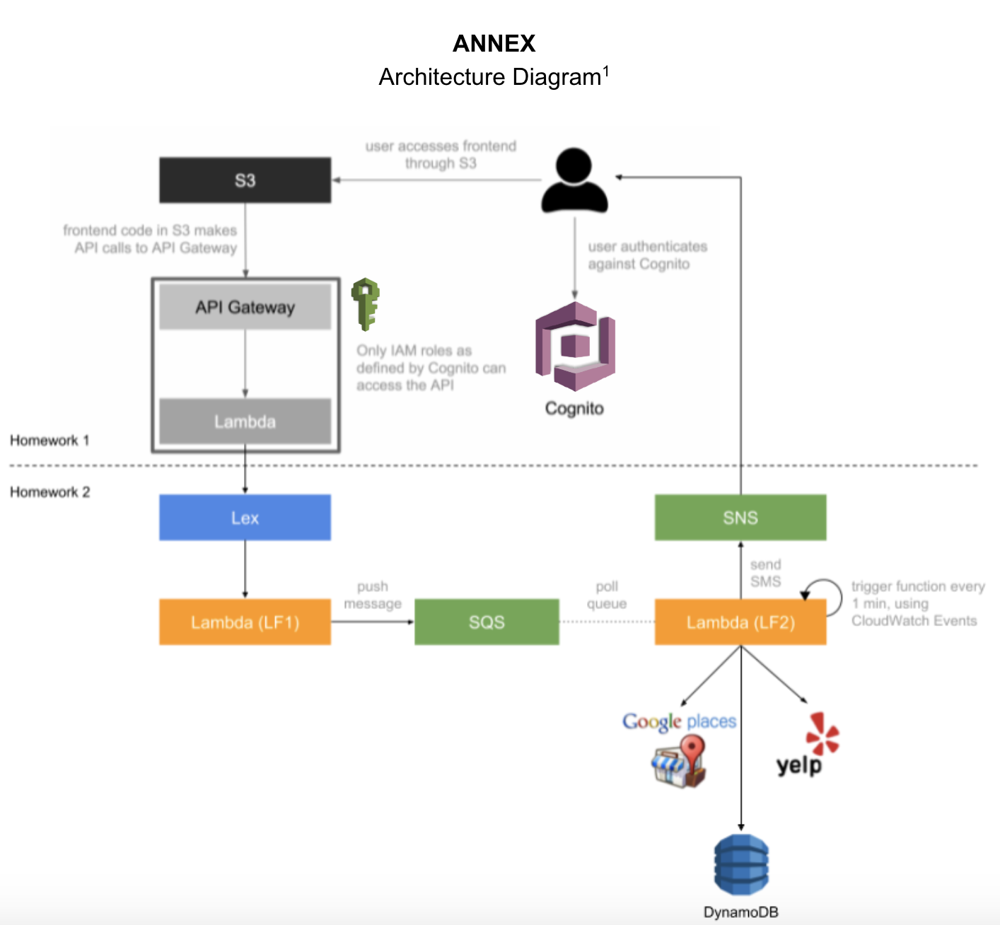
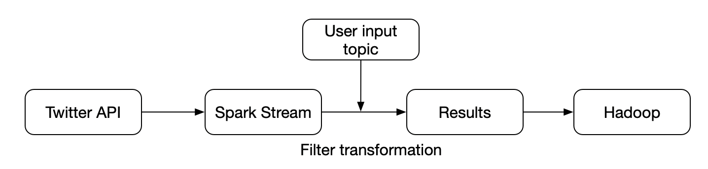
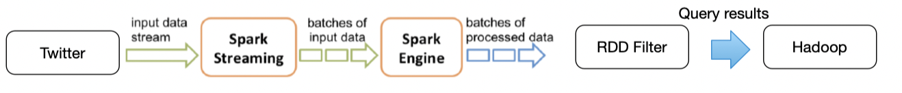
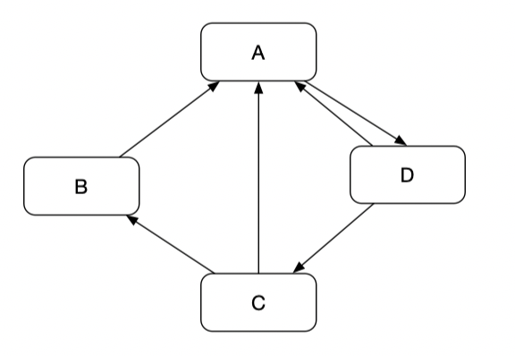

# Quiz 2

### hy2574 Haoyu Yan

## A
### 1

The infrastructure is as below:



Step 1: Creating a Bucket and Configuring It as a Website

1. Sign in to the AWS Management Console and open the Amazon S3 console at [https://console.aws.amazon.com/s3/](https://console.aws.amazon.com/s3).

2. Create a bucket.

   For step-by-step instructions, see [How Do I Create an S3 Bucket?](https://docs.aws.amazon.com/AmazonS3/latest/user-guide/create-bucket.html) in *Amazon Simple Storage Service Console User Guide*.

   For bucket naming guidelines, see [Bucket Restrictions and Limitations](https://docs.aws.amazon.com/AmazonS3/latest/dev/BucketRestrictions.html). If you have a registered domain name, for additional information about bucket naming, see [Customizing Amazon S3 URLs with CNAMEs](https://docs.aws.amazon.com/AmazonS3/latest/dev/VirtualHosting.html#VirtualHostingCustomURLs).

3. Open the bucket **Properties** pane, choose **Static Website Hosting**, and do the following:

   1. Choose **Use this bucket to host a website**.

   2. In the **Index Document** box, type the name of your index document. The name is typically`index.html`.

   3. Choose **Save** to save the website configuration.

   4. Write down the **Endpoint**.

      This is the Amazon S3-provided website endpoint for your bucket. You use this endpoint in the following steps to test your website.

Step 2: Adding a Bucket Policy That Makes Your Bucket Content Publicly Available

1. In the **Properties** pane for the bucket, choose **Permissions**.

2. Choose **Add Bucket Policy**.

3. To host a website, your bucket must have public read access. It is intentional that everyone in the world will have read access to this bucket. Copy the following bucket policy, and then paste it in the Bucket Policy Editor.

   ```
   {
      "Version":"2012-10-17",
      "Statement":[{
    	"Sid":"PublicReadForGetBucketObjects",
            "Effect":"Allow",
    	  "Principal": "*",
          "Action":["s3:GetObject"],
          "Resource":["arn:aws:s3:::example-bucket/*"
          ]
        }
      ]
    }
   ```

4. In the policy, replace *example-bucket* with the name of your bucket.

5. Choose **Save**.

Step 3: Uploading an Index Document

1. Create a document. Give it the same name that you gave the index document earlier.

2. Using the console, upload the index document to your bucket.

   For instructions, see [Uploading S3 Objects](https://docs.aws.amazon.com/AmazonS3/latest/user-guide/upload-objects.html) in the *Amazon Simple Storage Service Console User Guide*.

Step 4: Testing Your Website 

   Type the following URL in the browser, replacing *example-bucket* with the name of your bucket and*website-region* with the name of the AWS Region where you deployed your bucket. For information about AWS Region names, see [Website Endpoints](https://docs.aws.amazon.com/AmazonS3/latest/dev/WebsiteEndpoints.html) ).

   ```
   http://example-bucket.s3-website-region.amazonaws.com
   ```

   If your browser displays your `index.html` page, the website was successfully deployed.

   Note

   HTTPS access to the website is not supported.

   You now have a website hosted on Amazon S3. This website is available at the Amazon S3 website endpoint. However, you might have a domain, such as `example.com`, that you want to use to serve the content from the website you created. You might also want to use Amazon S3 root domain support to serve requests for both `http://www.example.com` and `http://example.com`. 

### 2

You want to use AWS Cognito as your identity provider, because it integrates easily with API Gateway. What Cognito resources do you need to create? Please specify the purpose of each resource you are going to create.

 

**User Pool:**

 

A user pool is a user directory in Amazon Cognito. With a user pool, users can sign in to our web or mobile app through Amazon Cognito. Our users can also sign in through social identity providers like Facebook or Amazon, and through SAML identity providers. Whether our users sign in directly or through a third party, all members of the user pool have a directory profile that we can access through an SDK. 

 

User pools provide:

·       Sign-up and sign-in services.

·       A built-in, customizable web UI to sign in users.

·       Social sign-in with Facebook, Google, and Login with Amazon, as well as sign-in with SAML identity providers from your user pool.

·       User directory management and user profiles.

·       Security features such as multi-factor authentication (MFA), checks for compromised credentials, account takeover protection, and phone and email verification.

·       Customized workflows and user migration through AWS Lambda triggers.

 

As for our assignment 2&3, we create a user pool to manage users of our website. We configure the our app to the user pool. We allow users to sign up and sign in using their emails and passwords. And we can delete or add uses of our website in user pool. And user pool provides us with a default sign in or sign out user interface. We modify the user interface to make it pretty. After we configure app to user pool, we can get a URL to allow users to sign in or sign up. After user sign in or sign up, user can use our web app.


**Identity Pool:**

Amazon Cognito identity pools (federated identities) enable we to create unique identities for users and federate them with identity providers. With an identity pool, we can obtain temporary, limited-privilege AWS credentials to access other AWS services. Amazon Cognito identity pools support the following identity providers:

·       Public providers: [Login with Amazon (Identity Pools)](https://docs.aws.amazon.com/cognito/latest/developerguide/amazon.html), [Facebook (Identity Pools)](https://docs.aws.amazon.com/cognito/latest/developerguide/facebook.html), [Google (Identity Pools)](https://docs.aws.amazon.com/cognito/latest/developerguide/google.html).

·       [Amazon Cognito User Pools](https://docs.aws.amazon.com/cognito/latest/developerguide/cognito-user-identity-pools.html)

·       [Open ID Connect Providers (Identity Pools)](https://docs.aws.amazon.com/cognito/latest/developerguide/open-id.html)

·       [SAML Identity Providers (Identity Pools)](https://docs.aws.amazon.com/cognito/latest/developerguide/saml-identity-provider.html)

·       [Developer Authenticated Identities (Identity Pools)](https://docs.aws.amazon.com/cognito/latest/developerguide/developer-authenticated-identities.html)

 

As for our assignment 2&3, we use identity pool to create roles involved in our web app. There are two roles: authenticated user and un authenticated user. With an identity pool, we can assign each authenticated user with temporary, limited-privilege AWS credentials to access other AWS services. So authenticated user can access our web app. 

### 3

What it is:

The Amazon S3 notification feature enables you to receive notifications when certain events happen in your bucket. To enable notifications, you must first add a notification configuration identifying the events you want Amazon S3 to publish, and the destinations where you want Amazon S3 to send the event notifications. You store this configuration in the *notification* subresource associated with a bucket. Amazon S3 provides an API for you to manage this subresource.

How to use:

Enabling notifications is a bucket-level operation; that is, you store notification configuration information in the *notification* subresource associated with a bucket. You can use any of the following methods to manage notification configuration:

- Using the Amazon S3 console

  The console UI enables you to set a notification configuration on a bucket without having to write any code. For instruction, see [How Do I Enable and Configure Event Notifications for an S3 Bucket?](https://docs.aws.amazon.com/AmazonS3/latest/user-guide/enable-event-notifications.html) in the *Amazon Simple Storage Service Console User Guide*.

- Programmatically using the AWS SDKs

  Note

  If you need to, you can also make the Amazon S3 REST API calls directly from your code. However, this can be cumbersome because it requires you to write code to authenticate your requests.

  Internally, both the console and the SDKs call the Amazon S3 REST API to manage *notification*subresources associated with the bucket. For notification configuration using AWS SDK examples, see the walkthrough link provided in the preceding section.

  Regardless of the method you use, Amazon S3 stores the notification configuration as XML in the *notification* subresource associated with a bucket. For information about bucket subresources, see [Bucket Configuration Options](https://docs.aws.amazon.com/AmazonS3/latest/dev/UsingBucket.html#bucket-config-options-intro)). By default, notifications are not enabled for any type of event. Therefore, initially the *notification* subresource stores an empty configuration.

  ```html
  <NotificationConfiguration xmlns="http://s3.amazonaws.com/doc/2006-03-01/"> 
  </NotificationConfiguration>
  ```

  To enable notifications for events of specific types, you replace the XML with the appropriate configuration that identifies the event types you want Amazon S3 to publish and the destination where you want the events published. For each destination, you add a corresponding XML configuration. For example:

  - Publish event messages to an SQS queue—To set an SQS queue as the notification destination for one or more event types, you add the `QueueConfiguration`.

    ```html
    <NotificationConfiguration>
      <QueueConfiguration>
        <Id>optional-id-string</Id>
        <Queue>sqs-queue-arn</Queue>
        <Event>event-type</Event>
        <Event>event-type</Event>
         ...
      </QueueConfiguration>
       ...
    </NotificationConfiguration>
    ```

  - Publish event messages to an SNS topic—To set an SNS topic as the notification destination for specific event types, you add the `TopicConfiguration`.

    ```html
    <NotificationConfiguration>
      <TopicConfiguration>
         <Id>optional-id-string</Id>
         <Topic>sns-topic-arn</Topic>
         <Event>event-type</Event>
         <Event>event-type</Event>
          ...
      </TopicConfiguration>
       ...
    </NotificationConfiguration>
    ```

  - Invoke the AWS Lambda function and provide an event message as an argument—To set a Lambda function as the notification destination for specific event types, you add the`CloudFunctionConfiguration`.

    ```html
    <NotificationConfiguration>
      <CloudFunctionConfiguration>   
         <Id>optional-id-string</Id>   
         <Cloudcode>cloud-function-arn</Cloudcode>        
         <Event>event-type</Event>      
         <Event>event-type</Event>      
          ...  
      </CloudFunctionConfiguration>
       ...
    </NotificationConfiguration>
    ```

  To remove all notifications configured on a bucket, you save an empty`<NotificationConfiguration/>` element in the *notification* subresource.

  When Amazon S3 detects an event of the specific type, it publishes a message with the event information. 

  ### 4

  **Use Case 1**:

  Use Case Name: LF2

  Actors: 1. SQS 2. Users 3. Yelp API 4. DynamoDB 5. SNS

  Description: The CloudWatch periodically executes LF2. When user is interacting with Lex Robot, Lex Robot will retrieve important information (slots defined in Lex) from dialogue. Then the information will be pushed to SQS queue in another lambda function. In LF2, we pull one message from SQS queue and parse it. By parsing the message, we can get important information provided by user, such as phone number, number of people, category, etc. Then we use Yelp API to get restaurant suggestions according to information we get. Then we store suggestions in DynamoDB. And we also use SNS to send suggestions to corresponding user.  

  **Use Case 2**:

  Use Case Name: index-photos

  Actors: 1. ElasticSearch 2. Rekognition 

  Description: When I upload an image to S3, index-photos will be executed once. Index-photos uses Rekognition to identify labels in the image and construct a JSON object, then store the JSON object to ElasticSearch. 

  ## B

  We design a system searching the news on twitter that have the given hashtag.

  Here is the API that we need to use to get the streaming data from twitter:

  ```java
  JavaStreamingContext ssc = new JavaStreamingContext(conf, new Duration(1000));
  JavaDStream<Status> tweetsStream=ssc.twitterStream()
  ```

  The code above we initialize the tweeter data stream.

  Then we need get the user's input to filter the data stream.

  ```java
  Scanner reader = new Scanner(System.in);  
  System.out.println("Enter a topic!: ");
  int topic = reader.nextInt(); 
  reader.close();
  ```

  Next we need to use the API to get a tweeter filter query:

  ```java
  FilterQuery tweetFilterQuery = new FilterQuery(); // See 
  tweetFilterQuery.track(new String[]{topic}); // keywords
  tweetFilterQuery.locations(new double[][]{new double[]{-126.562500,30.448674},
                  new double[]{-61.171875,44.087585
                  }});  // Only search news in USA
  tweetFilterQuery.language(new String[]{"en"}); // //Only search news that is written in English.
  ```

  Finally we can use filter transformation to get our results, and then we can save it as Hadoop Files.

  ```java
  JavaDstream<String> results = twitterStream.filter(tweetFilterQuery);
  results.saveAsHadoopFiles("hdfs://...")
  ```


  The architecture design and data flow is as below:

  Architecture:

  

  Data Flow:

  


  ## C

  ### C.1

  In spark, each RDD is represented by a Scala object.

  

  The RDDs are: linesRDD, ranksRDD, contributionsRDD, links_join_ranksRDD, contributions_reducedByKeyRDD,

  The transformations are: join, flatMap, reduceByKey, mapValues.

  ### C.2

  $Pr(A) = 0.15 + 0.85 * (1+1/2 + 1/2) = 1.85$

  $Pr(B) = 0.15 + 0.85 * 1 /2 = 0.575 $

  $Pr(C) = 0.15 + 0.85 * 1 /2 = 0.575$

  $Pr(D) = 0.15 + 0.85 * 1 = 1$

  ## D

  Assume we have the raw file raw_file.txt

  **First, put the file into S3 bucket by command:**

  ```shell
  aws s3 mb s3://{your_bucket_name}
  ```

  and then upload it to S3.

  **Second, create the spark cluster on AWS EMR (use the m3.xlarge instances)**

  command, the install number is 4:

  ```scala
  *elastic-mapreduce --create --alive --name "Spark/Shark Cluster"  \*
  
  *--bootstrap-action s3://elasticmapreduce/samples/spark/0.8.1/install-spark-shark.sh \*
  
  *--bootstrap-name "Spark/Shark"  --instance-type m3.xlarge --instance-count 4*
  ```

  Then the command will return the job with ID, assume this ID is XXX

  When the cluster is in “warning” state, which means it is ready to accept queries, I connect to master node of Spark cluster using SSH:

  ```scala
  *elastic-mapreduce --ssh XXX*
  ```

  Then I can connect to the master node.

  **Then, run query in spark shell.**

  Enter the spark shell:

  ```scala
  *SPARK_MEM="2g" /home/hadoop/spark/spark-shell // enter spark shell*
  *val file = sc.textFile("s3://[your-bucket-name]/raw_file.txt") // load file into spark from S3*
  val counts = file
    .flatMap(line => line
      .toLowerCase()
      .replace(".", " ")
      .replace(",", " ")
      .split(" "))
    .map(word => (word, 1L))
    .reduceByKey(_ + _) //  count words in file, replacing dots and commas with space:
  val sorted_counts = counts.collect().sortBy(wc => -wc._2)
  sorted_counts.take(10).foreach(println)
  # prints lines containing (word, count) pairs
  *//  Inspect ten most prominent words (using unary minus to invert sort-order, i.e. descending):*
  *sc.parallelize(sorted_counts).saveAsTextFile("s3://[your-bucket-name]/word count-raw_file ")// Save the sorted counts in S3:*
  
  *elastic-mapreduce --terminate XXX*
  ```

   
